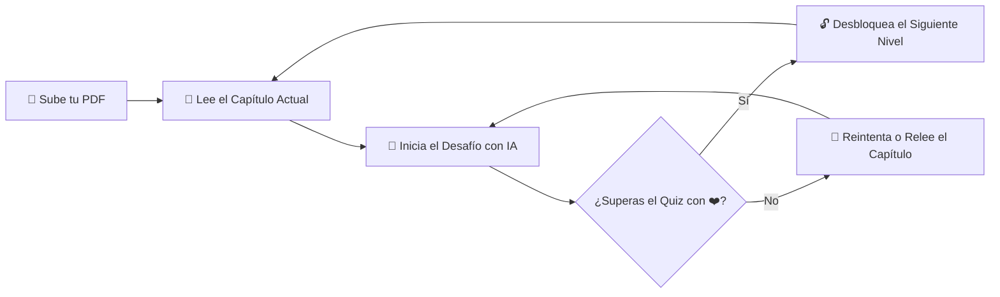

# 📚 LECTURAMA

<div align="center">


**La plataforma que convierte la lectura en aprendizaje entretenido, donde cada libro esconde un reto.**

</div>

---

## 📖 ¿Qué es LECTURAMA?

**LECTURAMA** es un lector de libros en formato PDF gamificado que transforma la experiencia de lectura tradicional en un videojuego de aprendizaje.

El libro se divide automáticamente en capítulos que funcionan como **niveles progresivos**: para desbloquear y avanzar al siguiente capítulo, el lector debe superar un **desafío de comprensión lectora de 5 preguntas formuladas por Inteligencia Artificial (Google Gemini)** basado exactamente en las páginas que acaba de leer.

---

## ✨ Características Principales

- 📖 **Visor Continuo de PDFs**:
  - Lectura vertical fluida con carga optimizada página por página.
  - Totalmente adaptado para pantallas móviles, tablets y ordenadores de escritorio.
- 🎯 **Gamificación por Niveles y Bloqueo de Capítulos**:
  - Los capítulos siguientes permanecen bloqueados (`🔒`) hasta superar el quiz del nivel actual.
  - Las secciones introductorias (portadas, prólogos, índices) se detectan automáticamente y quedan libres para lectura inicial.
- 🧠 **Desafíos Pedagógicos con IA (Google Gemini)**:
  - Generación bajo demanda (solo cuando el lector termina un capítulo).
  - 5 preguntas de opción múltiple estructuradas con explicaciones formativas inmediatas.
  - **Dificultad Adaptativa**:
    - 🧒 **Básica**: Niños (8 a 12 años) — Vocabulario simple y preguntas directas.
    - 🧑‍🎓 **Media**: Jóvenes (13 a 17 años) — Análisis y vocabulario estándar.
    - 🎓 **Avanzada**: Adultos — Preguntas profundas, inferenciales y de síntesis.
- ❤️ **Sistema de 3 Vidas y Flexibilidad**:
  - 3 vidas por nivel. Si pierdes todas las vidas, puedes reintentar el desafío.
  - Botón **"Pausar y salir"**: Guarda el progreso de preguntas y vidas para releer el texto sin reiniciar el quiz.
  - Botón **"🏳️ Abandonar quiz"**: Permite descartar el intento para cambiar la dificultad o generar preguntas nuevas.
- ⚡ **Resiliencia y Fast-Fallback**:
  - Conmutación automática e instantánea a modelos ultra-rápidos (`gemini-3.5-flash-lite`) ante picos de demanda (errores 503/429) o timeouts.
- 💾 **Persistencia Unificada por UUID**:
  - Todo el progreso de lectura, niveles desbloqueados y estado del quiz se asocia a un UUID de sesión anónima en `localStorage` (sin necesidad de registro previo).

---

## 🎮 ¿Cómo Funciona?



1. **Sube tu libro**: Arrastra o selecciona cualquier archivo PDF.
2. **Lee a tu ritmo**: Navega por las páginas del capítulo con el visor continuo.
3. **Supera el reto**: Al final del capítulo, pulsa **"Comenzar Quiz del Nivel"**.
4. **Desbloquea el siguiente capítulo**: Responde correctamente conservando tus vidas para continuar tu viaje de lectura.

---

## 🛠️ Stack Tecnológico

- **Framework**: [Next.js 16 (App Router)](https://nextjs.org/) con motor Turbopack.
- **Lenguaje**: [TypeScript](https://www.typescriptlang.org/) con tipado estricto.
- **Inteligencia Artificial**: [Google Gen AI SDK (`@google/genai`)](https://aistudio.google.com/)
  - Modelo Principal de Quiz: `gemini-3.5-flash`
  - Modelo de Respaldo Ultra-Rápido: `gemini-3.5-flash-lite`
  - Clasificador de Secciones: `gemma-4-31b-it`
- **Renderizado de PDFs**: [React-PDF](https://github.com/wojtekmaj/react-pdf) y `pdfjs-dist`.
- **Estilos y Tipografía**: [Tailwind CSS](https://tailwindcss.com/) + Google Fonts (**Outfit** y **Patrick Hand**).
- **Despliegue**: [Vercel](https://vercel.com/).

---

## 🚀 Instalación y Uso Local

### 1. Requisitos Previos
- [Node.js](https://nodejs.org/) v18.18+ o superior.
- Una clave API gratuita de [Google AI Studio](https://aistudio.google.com/).

### 2. Clonar el Repositorio
```bash
git clone https://github.com/FelipeRomeroDUOC/CoderCup-Lecturama.git
cd CoderCup-Lecturama
```

### 3. Instalar Dependencias
```bash
npm install
```

### 4. Configurar Variables de Entorno
Crea un archivo `.env.local` en la raíz del proyecto con tu clave de API:
```env
GEMINI_API_KEY=tu_api_key_de_google_ai_studio_aqui
```

### 5. Iniciar el Servidor de Desarrollo
```bash
npm run dev
```
Abre tu navegador en [http://localhost:3000](http://localhost:3000) para ver la aplicación en funcionamiento.

---

## ☁️ Despliegue en Vercel

1. Sube tu proyecto a GitHub.
2. Importa el repositorio en [Vercel](https://vercel.com/).
3. En la sección **Environment Variables**, añade:
   - `GEMINI_API_KEY`: *Tu API Key de Google AI Studio*.
4. Haz clic en **Deploy**. ¡Listo para usar en producción!

---

## 📁 Estructura del Proyecto

```text
├── docs/                     # Registro de las tareas técnicas del proyecto
├── src/
│   ├── app/
│   │   ├── api/
│   │   │   ├── chapters/[id]/
│   │   │   │   ├── classify/ # Clasificación de secciones con IA
│   │   │   │   └── questions/# Generador y caché de preguntas con IA
│   │   │   ├── dev/reset/    # Herramienta de reset para desarrollo
│   │   │   └── session/      # Endpoint de sesión anónima
│   │   ├── layout.tsx        # Layout principal y configuración de fuentes
│   │   └── page.tsx          # Landing page principal de LECTURAMA
│   ├── components/           # Componentes de UI (Lector, Visor, Sidebar, Quiz)
│   ├── hooks/                # Hooks personalizados (useChapters, useGamification)
│   ├── lib/                  # Lógica de IA (Gemini), sesión, PDFs y almacenamiento
│   └── types/                # Definiciones de tipos TypeScript
├── CHANGELOG.md              # Registro histórico de versiones
└── package.json
```

---

## 🤖 Desarrollo y Asistencia de IA

Este proyecto fue desarrollado íntegramente utilizando **Google Antigravity IDE** y asistido por el modelo de lenguaje **Gemini 3.7 Flash** (Google DeepMind) para la planificación arquitectónica, programación en pareja (*pair programming*), diseño de sistemas de resiliencia y documentación técnica de tareas.

---

## 📄 Licencia

Este proyecto fue desarrollado en el marco de la competencia CoderCup. Todos los derechos reservados.
